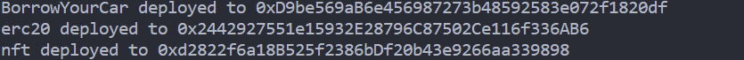
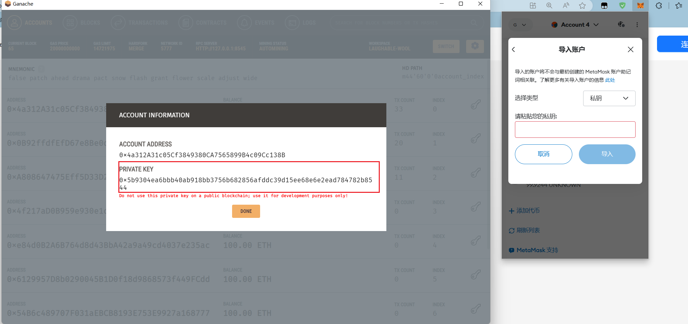
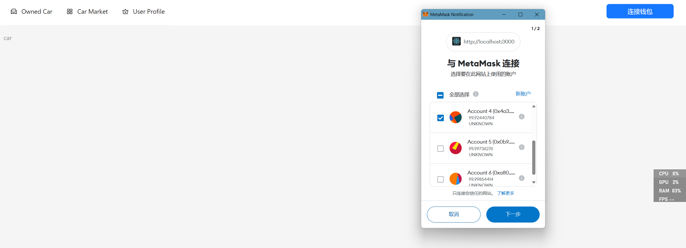
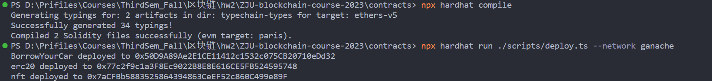
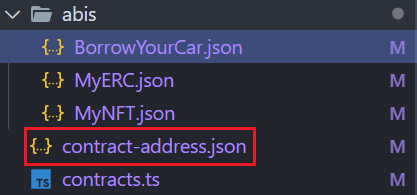
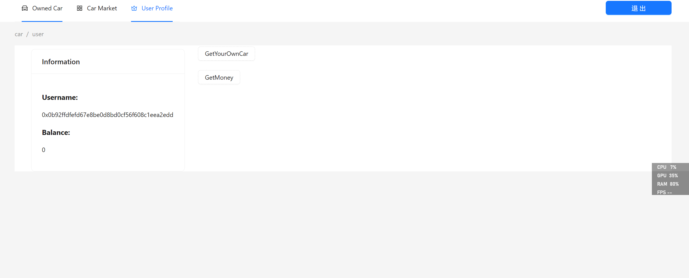
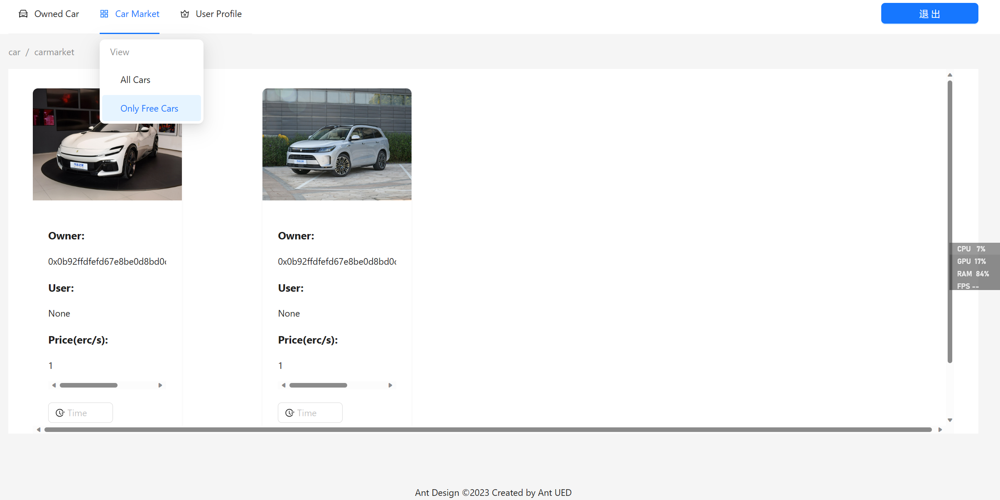
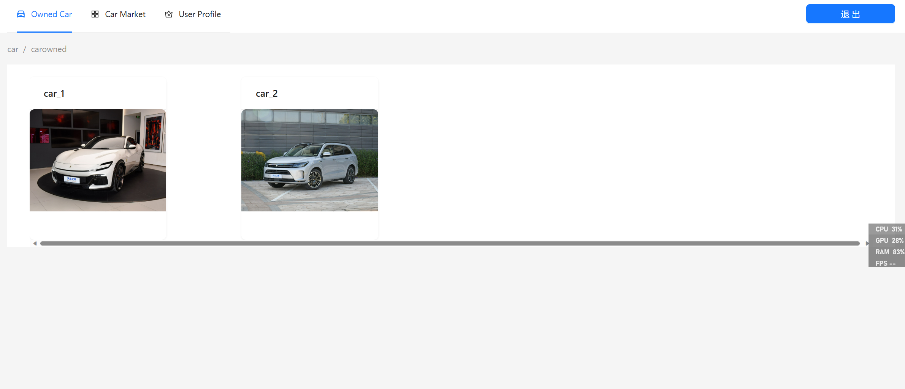

## Car-Borrowing System

**Student Id：** 3210105944 
**Name:** 黄锦骏

### 项目简介
```
    浙江大学2023年区块链与数字货币hw2-DApp, 实现了一个基于ERC4907的汽车租借系统，用户可以在该系统中
    租借汽车，汽车的租借消耗用户的erc20代币。在该系统中，用户可以查看自己拥有的汽车列表，查看当前的所
    有汽车以及空闲的汽车，并可以对空闲的汽车进行租用。
```

### 如何运行

1. 在本地启动ganache应用。

2. 在 `./contracts` 中安装需要的依赖，运行如下的命令：
    ```bash
    npm install
    ```
3. 在 `./contracts` 中编译合约，运行如下的命令：
    ```bash
    npx hardhat compile
    ```
4. 在本地开启ganache应用，并设定好RPC server端口号，在`./contracts/hardhat.config.ts`中编写对应network设置
5. 将合约部署到本地链上并记录合约部署地址，如下图所示：
    ```bash
    npx hardhat run ./scripts/deploy.ts --network ganache
    ```
    
6. 在 `./frontend` 中安装需要的依赖，运行如下的命令：
    ```bash
    npm install
    ```
7. 将编译后产生的 `./contract/artifacts/contracts`目录下的所有`*.json`文件拷贝到`./frontend/src/utils/abi`目录下，并在该目录下的`contract-address.json`文件中填入部署合约时记录的部署地址。
8. 在 `./frontend` 中启动前端程序，运行如下的命令：
    ```bash
    npm run start
    ```
9. 将Ganache中的示例账户的私钥导入到MetaMask中
    
    
10. 点击连接账户按钮，会自动唤起浏览器的MetaMask插件，选择相应的账户连接DApp应用，然后就正常可以使用了
     
11. 需要注意的是在切换页面后请再次点击连接钱包才能显示当前页面
### 功能实现分析

1. 创建一个合约，在合约中发行NFT集合，每个NFT代表一辆汽车

```
    关于NFC发行，我选择继承ERC721代币，编写了自己的MyNFT.sol合约，实现了汽车NFT的发行。在其中，我使用
    一个结构体Car来表示一辆汽车，包括汽车的id，汽车的拥有者，汽车的借用者，汽车的借用时间，汽车的借用时
    间单价。在该合约中，我主要完成了各种链上NFT数据的读取和修改等
```
   
2. 用户需求： 
+ 查看自己拥有的汽车列表。查看当前还没有被借用的汽车列表。
  ```
  关于此功能，我在前端实现了一个界面，点击后会调用MyNFT合约中的totalItems函数，将所有的汽车发回到前端，
  然后在前端对数据进行一个Filter，将所有的汽车中拥有者为当前用户的汽车筛选出来，然后显示在界面上
  ```
+ 查询一辆汽车的主人，以及该汽车当前的借用者（如果有）。
    ```
    关于此功能，我在前端实现了一个界面carmarket，将链上所有的汽车显示在界面上，并通过合约中的方法查询
    相应汽车的user(borrower), owner, price并显示在界面上
    ```
+ 选择并借用某辆还没有被借用的汽车一定时间。
    ```
    关于此功能，在合约BorrowYourCar中，调用borrowCar方法，首先对NFT的信息进行修改，然后再将NFT的所有
    权转给调用者，并将erc转账给owner。关于时间到期的检测，每当访问一次页面，就执行一次MyNFT.sol中的Check
    expired方法，该方法将对链上的所有NFT做一次检测，将过期的NFT的使用者和过期时间进行重置。
    ```


### 项目运行截图

1. 后端合约编译以及部署
   
2. 前端abi文件以及合约地址配置
   前三个.json文件是abi文件，最后一个是合约地址配置文件，具体获取方法见如何运行模块
   
3. 前端界面展示
 
   + UserInfo界面
      在此界面可以查看当前Metamask钱包连接到DApp的用户的信息，包括钱包地址，钱包余额。并可以通过两个按钮领取测试用的erc20代币和汽车NFT
    
   + CarMarket界面
      在此界面可以查看所有的汽车信息，包括汽车的id，汽车的拥有者，汽车的使用者，汽车的借用时间单价。并可以通过按钮借用汽车。也可通过选中Car Market的下滑栏中的Only Free Cars查看当前空闲的汽车
       
      
   + CarOwned界面
      在此界面可以用户可以查看当前自己拥有的汽车，汽车的名字会显示为car_+汽车的NFT id
       
    

**Notes:** 再次请注意在切换页面后请再次点击连接钱包才能显示当前页面
### 参考内容

- 课程的参考Demo见：[DEMOs](https://github.com/LBruyne/blockchain-course-demos)。

- ERC-4907 [参考实现](https://eips.ethereum.org/EIPS/eip-4907)

- ERC-721 [参考实现](https://ethereum.org/zh/developers/docs/standards/tokens/erc-721/)


